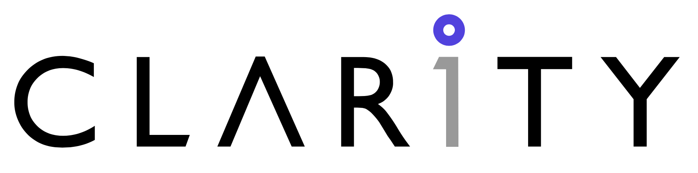

# Laravel Essentials Starter Kit

with Stricter Rules and CLARITY way

## Getting Started
**Create via Composer:**
```bash
composer create-project clarity-tech/laravel-strict
```

**Create via Laravel CLI:**
```bash
laravel new --using clarity-tech/laravel-strict
```

**Direct Clone and initialize via Laravel Sail in Docker environments **
You may install the application's dependencies by navigating to the application's directory and executing the following command. This command uses a small Docker container containing PHP and Composer to install the application's dependencies:

```shell
docker run --rm \
    -u "$(id -u):$(id -g)" \
    -v "$(pwd):/var/www/html" \
    -w /var/www/html \
    laravelsail/php84-composer:latest \
    composer install --ignore-platform-reqs
```

then run `sail composer install` or other sail commands


## Database Management with pgweb

The project includes [pgweb](https://github.com/sosedoff/pgweb), a web-based PostgreSQL database browser. 

**Accessing pgweb:**
1. Ensure services are running: `sail up -d`
2. Open pgweb interface at: http://localhost:8081

**Features:**
- View and query database tables
- Run SQL commands
- Export/import data
- View table schemas

**Configuration:**
- Default port: 8081 (customize via `FORWARD_PGWEB_PORT` in `.env`)
- Automatically connects to the PostgreSQL service using credentials from `.env`

The interface will be available after starting the Docker containers.

## Introduction
The CLARITY Laravel Starter Kit provides a robust foundation for building Laravel applications with pre-configured packages like Sail, Telescope, and Octane. This project adheres to CLARITY's development standards to ensure consistency and quality across all projects.  

## Features  
- Pre-configured Sail for local development  
- Integrated Telescope for debugging and performance monitoring  
- Octane for high-performance request handling  
- CLARITY-standard directory structure and coding conventions  

## CLARITY Development Standards  
- **Coding Standards:** Follow PSR-12 and CLARITY's internal style guide.  
- **Git Workflow:** Use feature branches and pull requests as outlined in CLARITY's Git workflow documentation.  
- **Testing:** All features require unit and integration tests.  
- **Deployment:** Follow CLARITY's deployment pipeline standards.  

## Contribution Guidelines  
Contributions should align with CLARITY's internal development processes. For more details, refer to our [Internal Contribution Guide](link-to-internal-doc).  

## Support  
For questions or support, visit our [official website](https://www.claritytech.io/) or contact support@claritytech.io.  

## License  
This starter kit is licensed under the MIT license.
