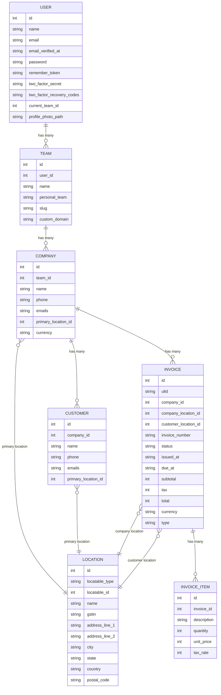

# Entity Relationship Diagram

```mermaid
erDiagram
    USER ||--o{ TEAM : "has many"
    TEAM ||--o{ COMPANY : "has many"
    COMPANY ||--o{ CUSTOMER : "has many"
    COMPANY ||--o{ INVOICE : "has many"
    INVOICE ||--o{ INVOICE_ITEM : "has many"
    COMPANY }o--|| LOCATION : "primary location"
    CUSTOMER }o--|| LOCATION : "primary location"
    INVOICE }o--|| LOCATION : "company location"
    INVOICE }o--|| LOCATION : "customer location"

    USER {
        int id
        string name
        string email
        string email_verified_at
        string password
        string remember_token
        string two_factor_secret
        string two_factor_recovery_codes
        int current_team_id
        string profile_photo_path
    }

    TEAM {
        int id
        int user_id
        string name
        string personal_team
        string slug
        string custom_domain
    }

    COMPANY {
        int id
        int team_id
        string name
        string phone
        string emails
        int primary_location_id
        string currency
    }

    CUSTOMER {
        int id
        int company_id
        string name
        string phone
        string emails
        int primary_location_id
    }

    INVOICE {
        int id
        string ulid
        int company_id
        int company_location_id
        int customer_location_id
        string invoice_number
        string status
        string issued_at
        string due_at
        int subtotal
        int tax
        int total
        string currency
        string type
    }

    INVOICE_ITEM {
        int id
        int invoice_id
        string description
        int quantity
        int unit_price
        int tax_rate
    }

    LOCATION {
        int id
        string locatable_type
        int locatable_id
        string name
        string gstin
        string address_line_1
        string address_line_2
        string city
        string state
        string country
        string postal_code
    }
```